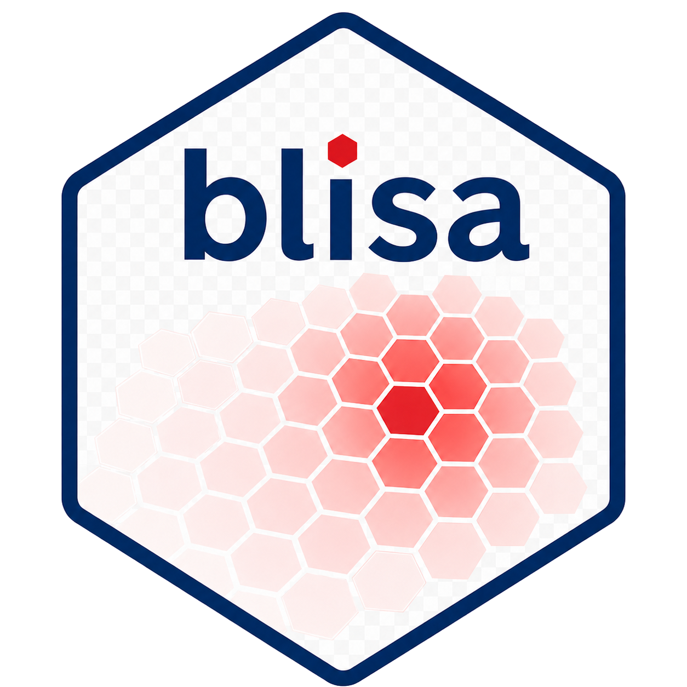

# blisa: Cell-cell communication using Bivariate Local Indicator of Spatial Autocorrelation 

## Overview

*blisa* identifies spatially enriched ligand-receptor (LR) interactions from
spatial transcriptomics data using bivariate Local Moran's I (LISA) statistics.
It bins cells into a hexagonal grid, computes the spatial co-enrichment of every
ligand-receptor pair across bins, and flags "High-High" hotspot bins where both
partners are co-expressed beyond chance. Results can be summarised at the
ligand-receptor or pathway level and visualised as spatial maps and heatmaps of
sender-receiver interactions.

## Installation

Install the development version from GitHub:

```r
library(devtools)
devtools::install_github("ChenLaboratory/blisa")
```

## Case studies

Step-by-step case studies showing blisa in action. Browse the full list under
the [**Vignettes**](https://chenlaboratory.github.io/blisa/articles/index.html)
tab, or start here:

- [Exploring cell-cell interaction with blisa](https://chenlaboratory.github.io/blisa/articles/xenium.html) -
  the core workflow on an imaging-based (Xenium) breast cancer dataset: hex
  binning, LR hotspot detection, and sender-receiver interaction scoring.
- [Visium profile of human breast tumour](https://chenlaboratory.github.io/blisa/articles/visium.html) -
  applying blisa to spot-based (Visium) data, including pathway-level
  aggregation with `blisaPathway()` and hotspots over the H&E image.
